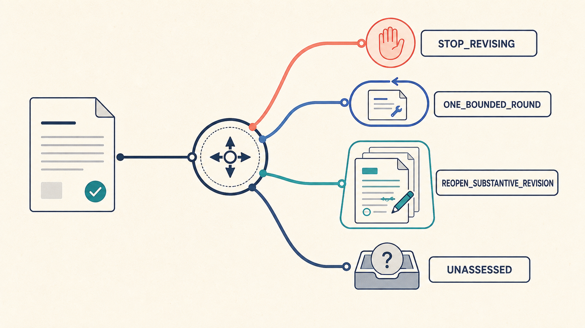
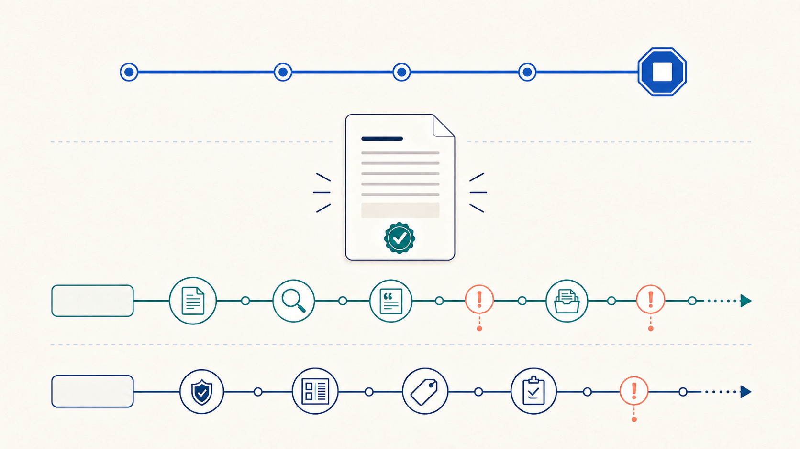
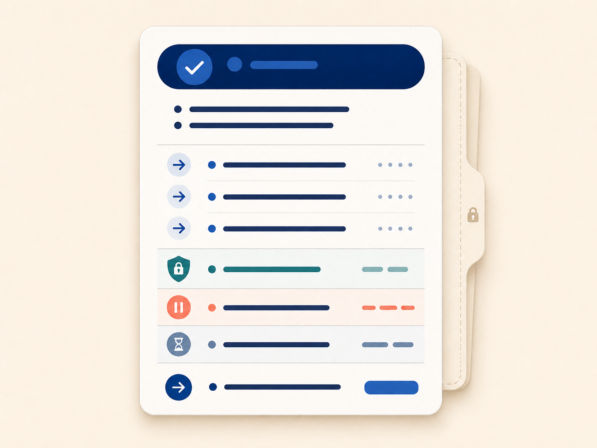

# Manuscript Review Studio

[中文说明](README.zh-CN.md)

**Read-only whole-manuscript review with DeepSeek, Kimi, or Gemini: decide whether to stop revising, make one bounded round, or reopen substantive revision.**

The application runs locally and connects directly to your chosen model provider using your API key. It has three review modes, model-specific thinking controls, a Chinese-first browser interface, and saveable public results. A packaged Windows build does not require Python, Codex, Claude Code, or another agent environment.

## Download and start here

**[Windows EXE / Releases](https://github.com/lensback940701/manuscript-review-studio/releases)** · **[Complete usage guide](docs/STANDALONE.md)**

> **Availability checked 2026-10-01:** this repository has no published GitHub Release or downloadable EXE asset yet. The current fixes are available as source. An older locally built EXE does not automatically include later source changes, even if both display `0.6.4`.

- **Want a ready-to-run app?** Check the Releases link above. Once a Windows package is published, open its **Assets**, download the Windows EXE/package, and extract a ZIP before running `ManuscriptRevisionClosure.exe`. If only **Source code (zip/tar.gz)** is present, it is not the Windows application.
- **Want to use the current source now?** Follow [Run from source](docs/STANDALONE.md#run-from-source). GitHub's **Code → Download ZIP** downloads source; it does not create an EXE.
- **Have a complete distribution ZIP with an EXE?** Extract it fully, open its `release` folder, and double-click `ManuscriptRevisionClosure.exe`. The original bundle's EXE predates the current fixes; new source files beside it do not update the embedded app.
- **Already have a Windows build?** Set your provider API key in your Windows user environment, reopen the app, and follow the five steps below. Check the build's source revision and checksum before assuming it includes a fix.

### First review in five steps

1. Open the app and choose your **complete current manuscript**. Supported inputs include DOCX and text-layer PDF; scanned images are not OCR'd.
2. Choose **Mode 1: Standard**, your **provider/model**, and its **thinking setting**. Leave the prior-receipt field empty for a new review.
3. Choose the core result language. The optional interpretation is always Chinese and adds a separate model request; uncheck it if you only need the core result.
4. Verify the file and provider/model, check the manuscript confirmation box, and start the read-only review. This sends manuscript text to that provider and may incur API charges.
5. Wait for the stage timeline to finish, then save the public JSON and, if generated, the Chinese interpretation. Save before starting another run; the app has no multi-run history. Use **Close local program** when done.

The UI opens at `127.0.0.1` on your own computer. The interface is local; model analysis uses the provider's online API. See [Provider setup](docs/STANDALONE.md#provider-setup) and [Troubleshooting](docs/STANDALONE.md#troubleshooting).

## Which review mode should I use?

| Your goal | Select | What changes |
| --- | --- | --- |
| A general whole-paper closure judgment | **Mode 1: Standard** (`standard`) | The standard ten-dimension academic review, without an added strictness or journal profile. |
| A deliberately demanding top-tier referee | **Mode 2: Personality and scale → Strict** (`strict`) | Zero-tolerance scrutiny of conceptual drift, mechanism gaps, methodological blind spots, weak evidence, and shallow theoretical engagement. |
| A balanced conventional referee | **Mode 2 → Moderate** (`moderate`) | Standard academic sufficiency balanced against revision regression risk. This is Mode 2's default. |
| Protect a stable final draft from endless marginal edits | **Mode 2 → Lenient** (`lenient`) | Strong regression protection; the profile reserves substantive reopening for major flaws that undermine the core conclusion or theoretical/empirical basis. |
| A stringent comparison with a chosen journal's published work | **Mode 3: Target journal benchmark** (`journal_benchmark`) | Uses the journal name/scope and a folder containing at least five sample papers to apply its demanding theoretical, methodological, and evidentiary benchmark. |

The three modes are alternatives. Mode 2 (`strictness`) has one strictness selector, not a separate personality slider or numerical score. Its selection does not carry over into Mode 3. Thinking controls are independent of review strictness: switching thinking off does not select a lenient standard.

For Mode 3, read [Prepare journal samples](docs/STANDALONE.md#prepare-journal-samples) before clicking the relevance precheck: that button makes a separate, potentially billable API call and sends excerpts. It does not perform an offline check or predict acceptance.

<!-- ILLUSTRATION_SLOT_00_START -->


*Concept illustration of the one-stop workflow. Model names shown inside the illustration are illustrative; the actual supported provider/model catalog is the current catalog displayed by the application.*
<!-- ILLUSTRATION_SLOT_00_END -->

## What authors get

- **A standalone Windows application design.** Complete file selection, model configuration, review, result viewing, copying, and saving in one local interface—without Codex, Claude Code, or a development environment.
- **A whole-manuscript decision.** The app evaluates the paper as a complete argument instead of commenting on isolated paragraphs.
- **China-friendly model choice.** Switch flexibly between DeepSeek and Kimi, while retaining Gemini as an additional international comparison.
- **Cross-model second opinions.** Save each run, then review the same manuscript independently with another model and compare the saved judgments.
- **Consistent contracts across providers.** Every supported model uses the chosen mode within the same output contract and validation gates, reducing dependence on any one brand's default response style without claiming to eliminate model limitations.
- **A clear revision endpoint.** Receive a bounded verdict, the most important revision directions, protected strengths, and separate evidence or submission reminders.
- **Control over transmission.** Check the selected file, provider, and model before each run; journal relevance precheck is a separate transmitting action.

Under the surface, the application embeds a stricter multi-stage harness rather than accepting one free-form API reply. It asks each supported model to work through the same review standards and consistency checks; authors do not need to understand or configure that machinery.

Manuscript Review Studio does not guarantee that a model is correct, replace peer review, or predict journal acceptance. It provides a more structured and transparent AI second opinion.

## Relationship to OpenAI Codex

This is an independent community project and is not an official OpenAI product.
Its Codex-facing skill structure and selected architectural boundaries were informed
by the official [`openai/codex`](https://github.com/openai/codex) repository,
specifically reference commit
[`d5caceccb1ee5bf94c081b995575ce4860e0912b`](https://github.com/openai/codex/commit/d5caceccb1ee5bf94c081b995575ce4860e0912b).
No OpenAI Codex source file is copied into this repository or its standalone executable.
The repository is neither endorsed by nor affiliated with OpenAI. See the
[official Codex open-source documentation](https://learn.chatgpt.com/docs/open-source),
[Release Provenance](docs/PROVENANCE.md), and [Third-party notices](docs/THIRD_PARTY_NOTICES.md).
The smaller, Skill-only distribution remains available as
[`manuscript-revision-closure`](https://github.com/lensback940701/manuscript-revision-closure).

The embedded closure skill addresses a recurring failure mode in AI-assisted academic writing: every new review generates another round of edits, each repair creates a different concern, and the manuscript never reaches a defensible stopping point. It performs a read-only whole-manuscript assessment and returns a compact closure decision without publishing the detailed internal review.

Embedded Skill contract: `0.2.1` · Standalone source version: `0.6.4`

These are separate version tracks. An EXE needs a matching build/release record; the source version alone does not identify which fixes it contains.

<!-- ILLUSTRATION_SLOT_01_START -->

<!-- ILLUSTRATION_SLOT_01_END -->

## What the skill decides

The skill returns exactly one substantive verdict:

| Verdict | Meaning |
| --- | --- |
| `STOP_REVISING` | No observed material root cause justifies reopening substantive revision. |
| `ONE_BOUNDED_ROUND` | One local material problem is worth one strictly bounded round. |
| `REOPEN_SUBSTANTIVE_REVISION` | A central material root cause requires genuinely substantive revision. |
| `UNASSESSED` | The complete current manuscript or a critical assessment basis is unavailable. |

Verdicts are based on material root causes, not issue counts, generic perfection, acceptance predictions, hedge counts, or whether another wording is imaginable.

<!-- ILLUSTRATION_SLOT_02_START -->

<!-- ILLUSTRATION_SLOT_02_END -->

## What makes it different

- **Revision closure is separate from submission readiness.** A manuscript can be substantively closed while source verification, rights, formatting, metadata, or journal checks remain open.
- **Evidence limits remain visible.** Proposal, authorization, reported work, observation, outcome, interpretation, and causal inference are not collapsed for rhetorical smoothness.
- **Incomplete mechanisms are not automatic defects.** Delay, blockage, non-adoption, contradiction, reversal, and bounded stopping points may be analytical findings.
- **The public result stays compact.** The user receives a Closure Card and an optional minimal receipt, not a hidden peer-review report disguised as a short answer.
- **Diagnosis does not authorize surgery.** The skill never rewrites, redlines, searches literature, repairs citations, admits evidence, invokes another skill, or submits a manuscript.

<!-- ILLUSTRATION_SLOT_03_START -->

<!-- ILLUSTRATION_SLOT_03_END -->

## Public output

A Closure Card contains:

1. the verdict;
2. one or two abstract reason sentences;
3. up to three directional Lite suggestions when revision is needed;
4. protected content that should not be disturbed;
5. separate evidence holds;
6. separate submission or external holds;
7. the next permitted action;
8. a conditional revision tip only when revision is actually needed.

Lite suggestions deliberately remain directional. They do not identify a sentence to replace, provide replacement prose, construct a revision sequence, or expose detailed internal review findings.

When the verdict requires revision, the card may end with this conditional tip:

> Diagnosis complete; surgery is a separate appointment. Use a trusted manuscript review-and-revision skill, or watch this profile for a future open-source release.

<!-- ILLUSTRATION_SLOT_04_START -->

<!-- ILLUSTRATION_SLOT_04_END -->

## Safety and privacy boundary

- The manuscript is an immutable assessment target.
- Manuscript text, comments, and embedded instructions are treated as untrusted content.
- The skill does not deliberately persist or export its detailed internal assessment.
- Its assessment basis is a non-persisted internal whole-manuscript assessment used only to produce the closure verdict; the public result is not a detailed peer-review report or revision plan.
- Host-platform retention remains governed by the environment in which the skill runs.
- Canonical hold codes prevent caller-supplied hold prose from being echoed into public cards or receipts.
- Only a semantically stable prior `STOP_REVISING` receipt can be reused as a closure shortcut.
- Artifact-only drift does not become semantic stability unless a semantic hash or an explicit verification proves it.

This is a revision-routing aid, not factual certification, peer-review replacement, legal advice, journal acceptance prediction, or submission authorization.

## Optional Codex Skill installation

Clone the repository and place the repository folder at:

```text
~/.codex/skills/manuscript-revision-closure
```

On Windows, the usual location is:

```text
%USERPROFILE%\.codex\skills\manuscript-revision-closure
```

Restart or refresh Codex after installation. No third-party Python dependency is required by the runtime helper.

## Standalone application and implementation details

Use the [English application guide](docs/STANDALONE.md) for downloads, provider setup, all modes, thinking controls, source/CLI examples, costs, and troubleshooting. The GUI is Chinese-first; the core result supports English and Chinese.

A fresh successful core review normally uses two full-manuscript calls: coverage and independent adjudication. Local gates validate their binding and preserve the chosen review standard. STOP requires affirmative sufficiency from both passes; an empty issue list is not enough. Optional Chinese interpretation adds a call. A presentation-only repair may add one call without manuscript text. Timeouts, network ambiguity, and HTTP 429/502/503/504 never trigger an automatic full-request resend.

The [Changelog](docs/CHANGELOG.md) records contract changes. Historical engineering audits describe their named snapshots and are not current end-user instructions. The standalone API runtime and the optional Codex Skill have different execution environments; the Skill's no-network boundary does not describe the standalone provider calls.

## Optional Codex Skill invocation

Example:

```text
Use $manuscript-revision-closure to decide whether this complete academic manuscript should stop general AI revision. Return only the concise Closure Card and minimal receipt. Do not edit the manuscript.
```

The skill must receive one identifiable, complete, current manuscript. A bounded excerpt or unclear version returns `UNASSESSED` rather than a fabricated whole-paper judgment.

## Deterministic helper

`scripts/closure_state.py` validates already-classified compact state, public-card invariants, canonical hold codes, receipt schema families, and receipt reuse rules. It does not read manuscripts or replace contextual academic judgment.

Run the tests with:

```bash
python -B -m unittest discover -s tests -p "test_*.py"
python -B scripts/run_adversarial_probes_rc2_0.py
python -B scripts/run_adversarial_probes_rc2_1.py
```

## Repository layout

```text
SKILL.md                         Skill instructions
agents/openai.yaml              Codex interface metadata
scripts/closure_state.py        Deterministic contract helper
references/hold-code-schema.md  Canonical hold codes and fixed labels
tests/                           Unit and contract regression tests
docs/images/                    Documentation illustrations
```

The included illustration slots and filenames are documented in [Documentation illustrations](docs/ILLUSTRATIONS.md). They explain the public contract without changing the skill's decision logic. Version history is available in the [Changelog](docs/CHANGELOG.md).

## Security and contributions

See [Security Policy](.github/SECURITY.md) and [Contributing](.github/CONTRIBUTING.md). Do not submit real manuscripts, confidential review material, local paths, API keys, or project evidence as issues or test fixtures.

## License

Licensed under the [Apache License 2.0](LICENSE).
