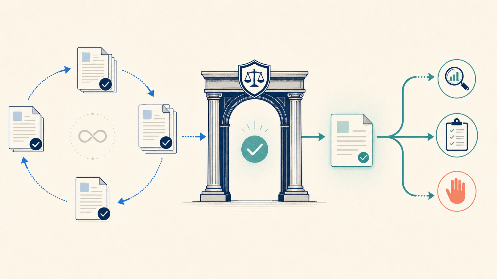
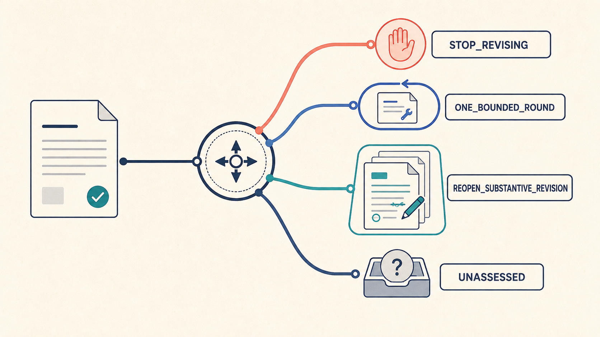
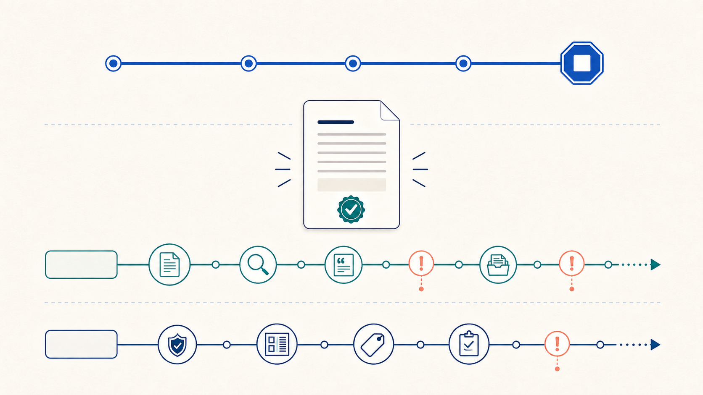
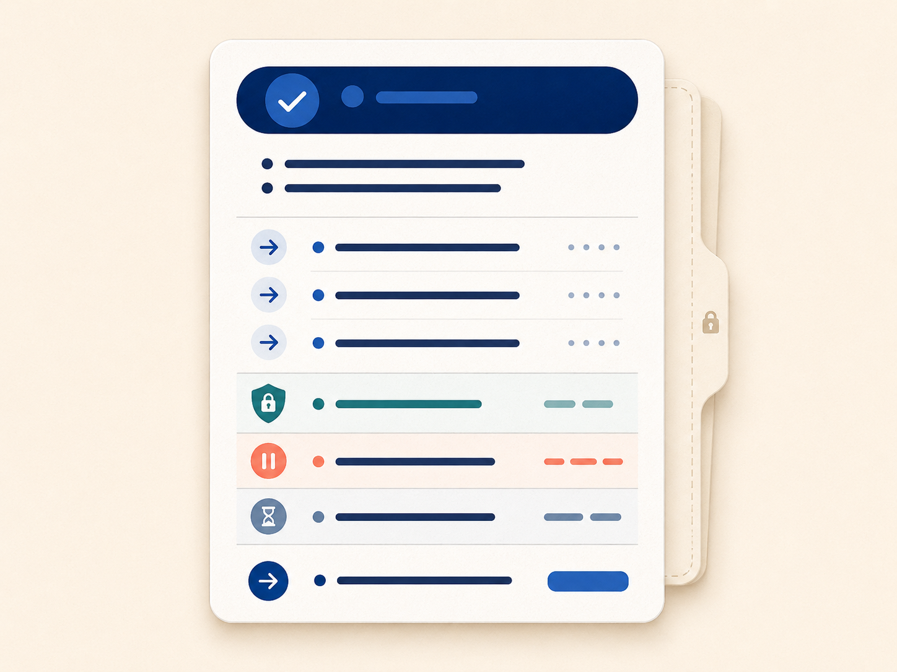

# Manuscript Review Studio：真正可以独立运行的 AI 整稿审阅软件

[English](README.md)

**打开 Windows 程序，选择模型，放入整篇论文，就能获得一次严格而有结论的独立复审——不依赖 Codex、Claude Code、ChatGPT 桌面端或任何 agent 环境。**

Manuscript Review Studio 是一款真正面向作者、能够一站式独立运行的桌面应用。从选择稿件和目标期刊样本文件夹，到设置 provider/model、确认全文外发、执行审阅、查看结果、复制与保存，都可以在同一个本地界面中完成。Windows 封装版使用你自己的 API key 直接连接 DeepSeek、Kimi 或 Gemini，不要求后台另开 AI 编程软件、IDE 插件或命令行 agent。

它不以“还能再改哪里”为默认答案，而是直接帮助作者判断：这篇论文是否已经可以停止通用改稿，是否只值得再做一轮有限修改，还是仍需重新开启实质性修订。你可以选择标准审阅，也可以设置审稿人格与严格度，还可以加入目标期刊样本论文文件夹，使修改意见更贴近期刊语境和作者的实际需求。

它尤其照顾中国用户的实际使用环境：程序界面和核心结果以中文为主，DeepSeek 与 Kimi 是一等支持的国产模型选项，费用估算可按人民币显示，同时仍可使用 Gemini 作为额外的国际模型参照。对于同一篇稿件，用户还可以分别选择不同模型进行多次独立复审，再对照各轮结论；这样能够减少对单一模型表达风格、能力长项与盲点的依赖。当前版本会如实保留每次独立结果，不会伪造一个自动汇总的“多模型共识”。

## 作者实际能够得到什么

- **真正一站式运行的 Windows 程序。** 文件选择、模型配置、审阅、结果查看、复制与保存都在一个本地界面中完成，不需要 Codex、Claude Code 或开发环境。
- **针对整篇论文作判断。** 它审查的是全文论证与章节之间的关系，而不是只点评几个孤立段落。
- **对中国用户和国产模型友好。** 可以灵活切换 DeepSeek、Kimi，并保留 Gemini 作为额外对照。
- **支持跨模型、多轮独立复审。** 同一稿件可以分别交由不同模型重复分析，通过对照结果获得更全面的审稿视角。
- **不同品牌使用同一套严格标准。** 所有支持的模型都被置于统一审稿合同与校验门禁中，降低对单一品牌默认风格的依赖，但不虚构能够消除模型能力边界。
- **给出清楚的修改终点。** 输出有限且明确的结论、最重要的修改方向、应当保护的优点，以及单列的证据或投稿事项。
- **全文外发前由你决定。** 程序会显示文件、provider 与 model，并要求本次运行重新确认后才会发送稿件。

程序内部嵌入了更严格的多阶段审稿 harness，而不是接受一次自由发挥的 API 回答。无论选择哪个品牌，模型都要按照同一套审稿标准和一致性检查完成工作；普通作者不需要理解或配置这些机制。

Manuscript Review Studio 不保证模型判断永远正确，也不替代同行评审或预测期刊接收。它提供的是一次结构更严谨、过程更透明的 AI 独立复审。

## 与 OpenAI Codex 的关系

本项目是独立维护的社区项目，不是 OpenAI 官方产品。Codex Skill 结构和部分架构边界参考了官方
[`openai/codex`](https://github.com/openai/codex) 仓库，具体参考 commit 为
[`d5caceccb1ee5bf94c081b995575ce4860e0912b`](https://github.com/openai/codex/commit/d5caceccb1ee5bf94c081b995575ce4860e0912b)。
本仓库及其 standalone EXE 均未复制 OpenAI Codex 源文件，也不代表 OpenAI 的认可、隶属或背书。可参见
[Codex 官方开源说明](https://learn.chatgpt.com/docs/open-source)、[发布来源说明](docs/PROVENANCE.zh-CN.md)与[第三方说明](docs/THIRD_PARTY_NOTICES.md)。
仅包含核心 Skill 的轻量仓库继续保留在
[`manuscript-revision-closure`](https://github.com/lensback940701/manuscript-revision-closure)。

其中的修订截止 Skill 针对 AI 辅助学术写作中常见的失败循环：每次检查都会生成下一轮修改，每次修补又引出新的问题，稿件始终无法到达一个可以说明理由的停止点。本 Skill 只读评估整篇当前稿件，给出紧凑的修订截止判断，但不向用户公开完整的内部审稿意见。

当前发布候选版本：`0.2.1`

<!-- ILLUSTRATION_SLOT_01_START -->

<!-- ILLUSTRATION_SLOT_01_END -->

## 它会做出什么判断

本 Skill 只返回以下四种实质性判断之一：

| 判断 | 含义 |
| --- | --- |
| `STOP_REVISING` | 没有观察到足以重新开启实质性修订的根本问题。 |
| `ONE_BOUNDED_ROUND` | 存在一个值得用一轮严格限定修改解决的局部实质问题。 |
| `REOPEN_SUBSTANTIVE_REVISION` | 仍有中央性实质根因，需要真正重新开启论文修订。 |
| `UNASSESSED` | 缺少完整的当前稿件，或者缺少作出可靠判断所必需的基础。 |

判断依据是真正的实质根因，而不是问题数量、抽象的完美标准、接收概率、保留词数量，或者“还能换一种写法”。

<!-- ILLUSTRATION_SLOT_02_START -->

<!-- ILLUSTRATION_SLOT_02_END -->

## 它与普通审稿工具有什么不同

- **修订截止与投稿准备彼此分开。** 稿件可以已经达到实质性截止，但来源核验、权利、格式、作者信息或期刊要求仍未完成。
- **证据上限必须保留。** 提议、授权、报告的工作、直接观察、结果、解释与因果推断不会因为追求流畅而被混在一起。
- **不完整的机制链不自动等于缺陷。** 延迟、阻断、未采用、矛盾、逆转和有界停止点本身可能就是分析结果。
- **公开输出保持紧凑。** 用户得到的是修订截止卡和可选的最小收据，而不是披着简短回答外衣的完整内部审稿报告。
- **诊断不等于获得手术授权。** 本 Skill 不改写、不留修订痕迹、不检索文献、不修复引文、不接纳新证据、不调用其他 Skill，也不投稿。

<!-- ILLUSTRATION_SLOT_03_START -->

<!-- ILLUSTRATION_SLOT_03_END -->

## 公开输出长什么样

一张修订截止卡包括：

1. 判断结果；
2. 一至两句抽象理由；
3. 仅在确实需要修改时给出不超过三条方向性轻量建议；
4. 不应扰动的受保护内容；
5. 单列的证据事项；
6. 单列的投稿或外部事项；
7. 下一步允许采取的行动；
8. 仅在确实需要修改时出现的条件性提示。

轻量建议会刻意保持方向性：不指出应替换的具体句子，不提供替换文本，不编制修订步骤，也不泄露内部完整审稿意见。

当判断结果确实需要修改时，卡片末尾可以出现这个条件性提示：

> 诊断到此，手术另约。请接入经过核实的审稿改稿 skill；或者，蹲一下本 profile 后续开源。

<!-- ILLUSTRATION_SLOT_04_START -->

<!-- ILLUSTRATION_SLOT_04_END -->

## 安全与隐私边界

- 稿件是不可修改的评估对象。
- 稿件正文、批注和嵌入指令都按不可信内容处理。
- 本 Skill 不会主动保存或导出详细内部评估。
- 本 skill 会在运行时进行一次不落盘的内部整稿评估，仅用于形成修订截止判断；默认不返回或保存完整审稿意见。
- 宿主平台如何留存对话与运行信息，仍由实际运行环境决定。
- 有限的标准事项代码可以防止调用者提供的自由文本被原样回显到公开卡片或收据。
- 只有与当前稿件明确绑定、语义内容稳定的既有 `STOP_REVISING` 收据才可作为截止捷径。
- 只有文件本身发生变化，并不能证明语义稳定；必须有语义哈希或明确核验作为依据。

本 Skill 是修订路由辅助工具，不是事实认证、同行评审替代品、法律意见、期刊接收预测或投稿授权。

## 安装

克隆本仓库，并将仓库文件夹放到：

```text
~/.codex/skills/manuscript-revision-closure
```

Windows 的常见位置是：

```text
%USERPROFILE%\.codex\skills\manuscript-revision-closure
```

安装后重启或刷新 Codex。运行时辅助程序不需要第三方 Python 依赖。

## 独立 Windows 程序

仓库同时提供一个实验性 standalone 多阶段合同运行层，可用 DeepSeek、Kimi 或 Gemini API 在不安装
Codex 的情况下执行只读截止输出合同。双击 EXE 会打开本地 GUI，并可选生成受
十一键合同约束的中文结果解读、判断依据/原则/维度、简要局限和投稿前核对清单。
GUI 还会按 API 返回的实际 token usage 和官方价格页估算本次费用。API key 只从环境变量读取。使用、构建和
安全边界见 [`STANDALONE.zh-CN.md`](docs/STANDALONE.zh-CN.md)。Standalone 版本与
Skill 版本分别管理，不改变本 Skill 的 `0.2.1` 合同版本。

Standalone 0.6.4 使用可见的多模型下拉框，并按 DeepSeek、Kimi、Gemini
具体模型的官方能力动态提供思考开关或强度选项；不支持的组合在调用前拒绝。
核心判断和可选中文解读均使用结构化输出；Gemini 与 Kimi 额外提交精确 JSON Schema，
并在本地只接受唯一完整对象及精确十一键合同。解读格式失败时仍记录该次调用的
token usage 用于费用估算。程序不再设置 5000 token 的小型输出截断，而按提供商设置
DeepSeek 384K、Kimi 128K、Gemini 64K 的高余量，并明确识别长度截断。Kimi/DeepSeek 以人民币官方价为原币，
Gemini 以美元官方价为原币，再用带日期的 ECB USD/CNY 参考汇率显示双币种估算。
核心判断采用两次绑定调用：十维整稿覆盖 pass 与真正独立、重新读取全文的 root-cause adjudication pass。coverage candidates 是第二阶段必须逐项复核的下限，不是上限；第二阶段可补充 coverage 漏报的 canonical、已观察、可定位且非重复的材料性维度。本地 contradiction gate 独立复核 coverage canonical SHA-256、candidate binding、双阶段肯定性 STOP、hold 和保护不变量。STOP 必须由两阶段对贡献、全稿论证、理论、方法、证据与章节连贯性作出肯定性充分判断；仅有谨慎、保护范围或没有夸大不能证明充分。
0.6.4 在该门通过后先冻结 canonical machine state，再验证公开自然语言。中文展示缺陷最多触发一次不含稿件的 schema-bound presentation-only request，且该请求不自动重试；失败只形成可恢复 presentation HOLD，不清除机器裁决或 usage。`mrc-local-technical-preflight-1.0` 仅阻断文件不可读、不支持/提取失败、零有效文本、超限或配置失败；标题、固定章节、顺序、编号、ATX/Setext/plain、YAML/TOML front matter 只产生 best-effort 格式 advisory，不能改变 provider routing。每次可能外发全文的运行默认拒绝，必须重新完成 `mrc-provider-transmission-consent-1.0` 明确确认，并绑定当前文件 SHA-256、provider 与 model；取消为用户未授权状态，API=0，不伪造成稿件或技术 HOLD。第一次且唯一一次 coverage 使用 `mrc-whole-manuscript-coverage-3.0` 与 `mrc-semantic-manuscript-basis-1.0` 判断整稿实质材料是否充分，不得仅因非传统格式判不足。basis 不足时只发生一次 coverage 并准确记录 usage/cost，adjudication=0、无 machine verdict、无 presentation source；HTTP/schema/binding 失败仍是独立 technical HOLD。provider error 仅公开经过限长与脱敏的 status、code 和单行 detail。
Kimi 覆盖阶段默认等待 300 秒，根因裁决和中文解读默认等待 900 秒；read/socket timeout
coverage、adjudication、presentation repair 与 interpretation 均只允许一次物理 HTTP attempt；timeout、网络状态不明、429、502、503、504 都不会自动重发全文。收据把已知 usage 小计与 `UNKNOWN_POTENTIAL_CHARGE` 请求分开表达，避免把未知 usage 当作零费用；即使实时价格不可用，完整 usage 回执计数也不会被抹除。

动态 adjudication schema 在 dispatch 前经过 `mrc-schema-definition-lint-1.0`。`mrc-dynamic-adjudication-schema-3.0` 对零候选采用 `minItems=0`、有限 canonical 上限和非空 canonical enum，使独立第二阶段可恢复已观察、可定位的 coverage 漏报，同时不生成 provider 非法的 `enum: []`。未知、重复、不可定位、臆测或无解释的补充均 fail closed。任何 schema definition 错误均在本地以 `SCHEMA_DEFINITION_INVALID` 停止，不会形成该阶段的付费请求。

## 调用

示例：

```text
请使用 $manuscript-revision-closure 判断这篇完整学术稿件是否应该停止通用 AI 改稿。只返回简洁的修订截止卡和最小收据，不要修改稿件。
```

本 Skill 必须读取一篇身份明确、完整且为当前版本的稿件。只有局部节选或版本不明确时，应返回 `UNASSESSED`，而不是伪造整稿判断。

## 确定性辅助程序

`scripts/closure_state.py` 只验证已经完成分类的紧凑状态、公开卡片约束、标准事项代码、收据版本以及收据复用规则。它不会自行读取稿件，也不能替代需要语境判断的学术评估。

运行测试：

```bash
python -B -m unittest discover -s tests -p "test_*.py"
python -B scripts/run_adversarial_probes_rc2_0.py
python -B scripts/run_adversarial_probes_rc2_1.py
```

## 仓库结构

```text
SKILL.md                         Skill 指令
agents/openai.yaml              Codex 界面元数据
scripts/closure_state.py        确定性契约辅助程序
references/hold-code-schema.md  标准事项代码及固定中英文标签
tests/                           单元测试和契约回归测试
docs/images/                    说明文档插图
```

已经采用的插图及其文件名记录在[说明文档插图](docs/ILLUSTRATIONS.zh-CN.md)中。这些插图用于解释公开契约，不改变本 Skill 的判断逻辑。历次版本变化见[更新记录](docs/CHANGELOG.zh-CN.md)。

## 安全与参与贡献

请阅读[安全政策](.github/SECURITY.zh-CN.md)和[参与贡献](.github/CONTRIBUTING.zh-CN.md)。不要把真实稿件、保密审稿材料、本地路径、接口密钥或项目证据提交为问题或测试样本。

## 许可证

本项目采用 [Apache License 2.0](LICENSE)。
